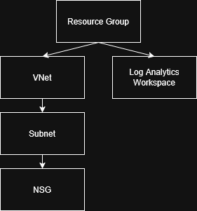

# Azure Terraform Landing Zone

## Overview
This project deploys a foundational Azure environment using Terraform, following infrastructure-as-code best practices.

## Architecture
- Resource Group
- Virtual Network
- Subnet
- Network Security Group (NSG)
- Log Analytics Workspace

## Architecture Diagram

## Technologies Used
- Terraform
- Microsoft Azure

## Deployment Steps
1. Clone the repository
2. Run `terraform init`
3. Run `terraform plan`
4. Run `terraform apply`

## Purpose
This project demonstrates:
- Infrastructure as Code (IaC)
- Azure networking
- Security configuration
- Monitoring setup

## Future Improvements
- Add Azure Bastion
- Deploy Virtual Machines
- Implement CI/CD pipeline